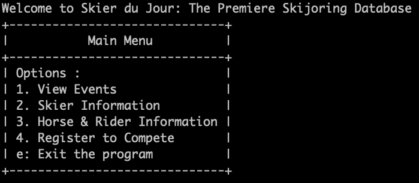

# Skier-du-jour:

### The most comprehensive database for skijoring stats!

# Getting started with the database:

## CLI features:

- Fork and Clone this repo to your local machine
- Navigate through the options provided in the main menu
- Learn about the sports leading athletes, beautiful event locations, and incredible racing teams
- Contribute to the database and help grow the knowledge of the sport
- Bonus: comprehensive pytest testing to ensure your object models have guardrails!
- COMING SOON: more detailed race statistics, including penalties, raw time, average speed, and race placements to fuel your analysis

### Navigate to the programs root directory and enter `python lib/cli.py` to run

Enjoy interacting with our elegant command line interface
